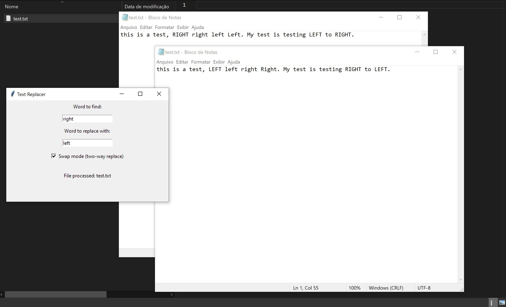

# Floating FAST Text Swapper
Text replacer and swapper. A floating box that you can drag and drop your txt file, and it will swap two chosen words.



## Install
* Install tkinterdnd2
```
pip install tkinterdnd2
```

## Getting started
* cd into this directory after cloning the repo
* start the app
Example:
```
py myapp.py
```
ctrl + c to exit or close the floating window